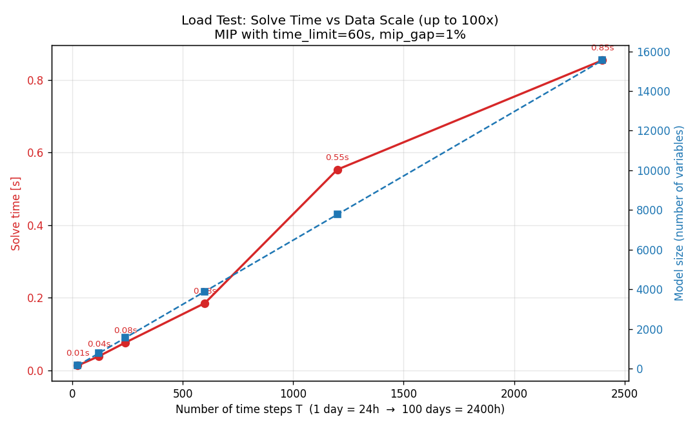

# Grid Battery Dispatch Optimizer

An educational simulator that **optimizes battery charge/discharge dispatch with
linear / mixed-integer programming (LP/MIP)** in response to variable renewable
(solar) generation, reducing energy procurement cost, transmission losses, and
renewable curtailment. The model is formulated with `pulp` and solved with the
HiGHS / CBC solvers.

> ⚠️ **Disclaimer**
> This repository is an **independent simulation built for learning / portfolio
> purposes**. It has no affiliation whatsoever with any real utility or grid
> operator, and is **not** endorsed, sponsored, or approved by any company
> (e.g., Berkshire Hathaway Energy). All data is **fully synthetic**, generated
> with `numpy`, and does not represent real demand, market prices, or
> transmission assets. This code is not intended for investment or operational
> decision-making.

---

## What it optimizes

For each time step over 24 hours (or any number of days), it decides:

- Amount of electricity purchased from the grid
- Battery charge / discharge amounts
- Solar curtailment amount

**Objective:** minimize total procurement cost, with transmission losses priced
into the cost.

**Key constraints:**

| Constraint | Description |
|---|---|
| Supply/demand balance | `solar + (purchase − transmission loss) + discharge == demand + charge` at every time step |
| State of charge (SoC) | `0 ≤ SoC ≤ capacity (default 100 MWh)`; SoC transitions reflect charge/discharge efficiency |
| Charge/discharge rate | `0 ≤ charge/discharge ≤ rate limit (default 20 MW)` |
| No simultaneous charge/discharge | A binary variable forbids charging and discharging in the same step (turns it into a MIP; optional) |
| Transmission loss | `loss = a·(grid-side flow)²` (I²R loss) modeled as a convex constraint via **piecewise-linear approximation with multiple tangents** |

> **About transmission loss (important)**
> Line loss is proportional to the square of flow (convex), so it is embedded
> into the LP by approximating it from below with a family of tangent lines.
> Because the objective minimizes total cost *including* losses, the battery
> **offsets peak-hour transmission to reduce losses** — but a **trade-off** can
> also occur where cheap overnight arbitrage increases total throughput and
> therefore losses. The simulator reports this increase or decrease honestly.
> Raise `loss_coeff` to weight losses more heavily.

---

## Project layout

```
.
├── data/
│   ├── generate_data.py   # synthetic data generation (any number of days)
│   └── power_data.csv      # generated 24-hour dataset (regenerable)
├── src/
│   ├── optimizer.py        # LP/MIP model, fallback logic, rule-based alternative
│   ├── main.py             # 24-hour simulation & report output
│   └── benchmark.py        # load test (up to 100x scale) & solve-time chart
├── results/
│   └── benchmark.png        # solve time vs data scale chart (regenerable)
├── requirements.txt
├── LICENSE                  # MIT
└── README.md
```

---

## Setup & run

```bash
# 1. Install dependencies
pip install -r requirements.txt

# 2. Generate simulation data (24 hours)
python data/generate_data.py

# 3. Run the optimization & report
python src/main.py

# 4. Load test (scale from 1 day to 100 days / chart output)
python src/benchmark.py
```

### About the solver
The CBC binary bundled with PuLP is x86_64 only and may fail to launch on Apple
Silicon (arm64). This project **prefers HiGHS (`highspy`, arm64-native)** and
falls back to CBC when it is unavailable (see `_get_solver` in
`src/optimizer.py`).

---

## Scalability & robustness

Built with production scale in mind:

1. **Solver control** — sets `time_limit` (cutoff seconds) and `mip_gap`
   (default 1% approximation tolerance) so it returns a solution within a
   practical time budget even as the problem grows.
2. **Sparse construction** — variables that are always zero (e.g., curtailment at
   night when `solar=0`) are never created; the constraint matrix is minimized
   with `lpSum` / dict comprehensions.
3. **Infeasibility tolerance** — it does not crash on `Infeasible` etc.; a
   two-stage fallback (① constraint relaxation with a penalty on unmet demand →
   ② rule-based alternative) always returns a feasible solution.

### Load-test results (reference values, environment-dependent)

| Scale | Steps T | Variables | Constraints | Solve time |
|---:|---:|---:|---:|---:|
| 1 day | 24 | 156 | 240 | ~0.01s |
| 10 days | 240 | 1,557 | 2,400 | ~0.08s |
| 100 days | 2,400 | 15,548 | 24,000 | ~0.9s |

Scaling the data 100x (24h → 2,400h) increases solve time roughly linearly and
still finds the optimal solution in under a second (regenerate with
`python src/benchmark.py`).



---

## Main parameters (`optimize_battery`)

| Argument | Default | Meaning |
|---|---|---|
| `capacity` | 100.0 | Battery capacity (MWh) |
| `max_rate` | 20.0 | Maximum charge/discharge rate (MW) |
| `loss_coeff` | 0.0006 | Transmission loss coefficient a (`loss = a·flow²`); 0 disables losses |
| `no_simultaneous` | True | Forbid simultaneous charge/discharge (MIP). False for pure LP (faster) |
| `time_limit` | 30.0 | Solver cutoff seconds |
| `mip_gap` | 0.01 | Acceptable MIP gap (approximation tolerance) |
| `grid_limit` | None | Grid purchase cap (MWh/h); too small triggers the fallback |

---

## Known limitations

- Data is synthetic and differs from real data / real market behavior.
- Transmission loss is a single-hub aggregate model (no power-flow computation,
  network constraints, or voltage / reactive power).
- A simplified single-bus, single-battery model without reliability constraints
  such as N-1.

These reflect an educational scope intended to demonstrate LP/MIP formulation of
battery dispatch and the engineering of scale and robustness.

## License
MIT License (see `LICENSE`).
